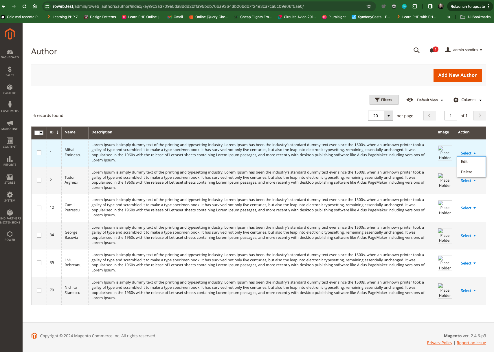
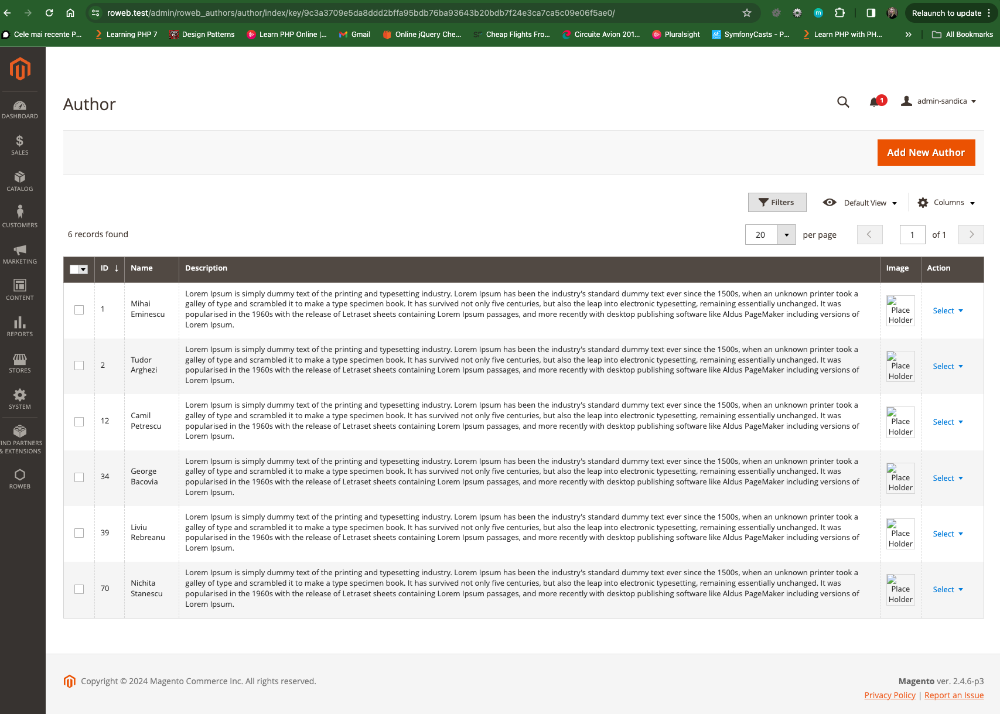
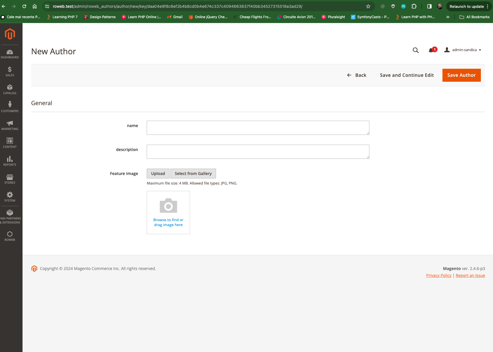
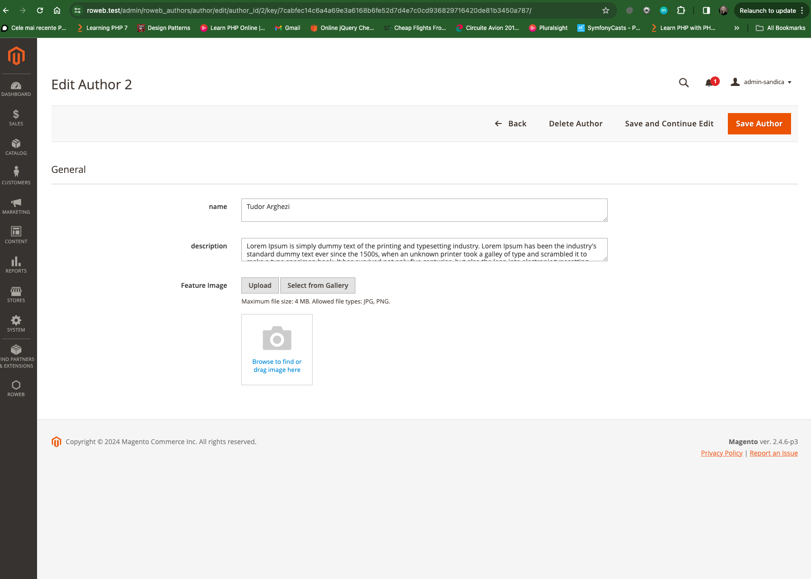
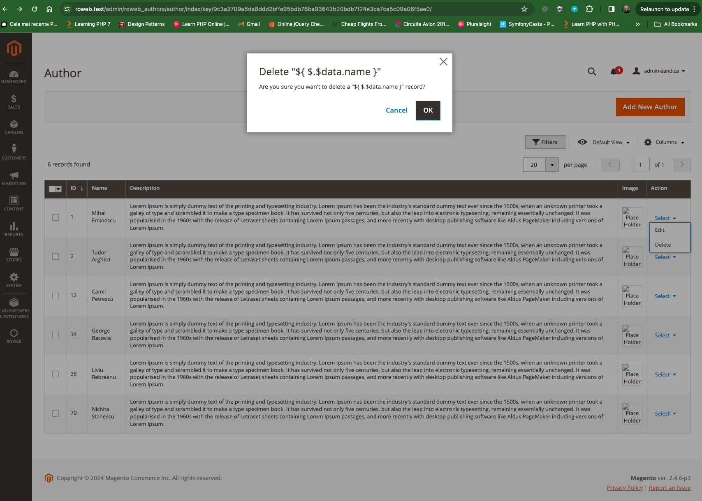
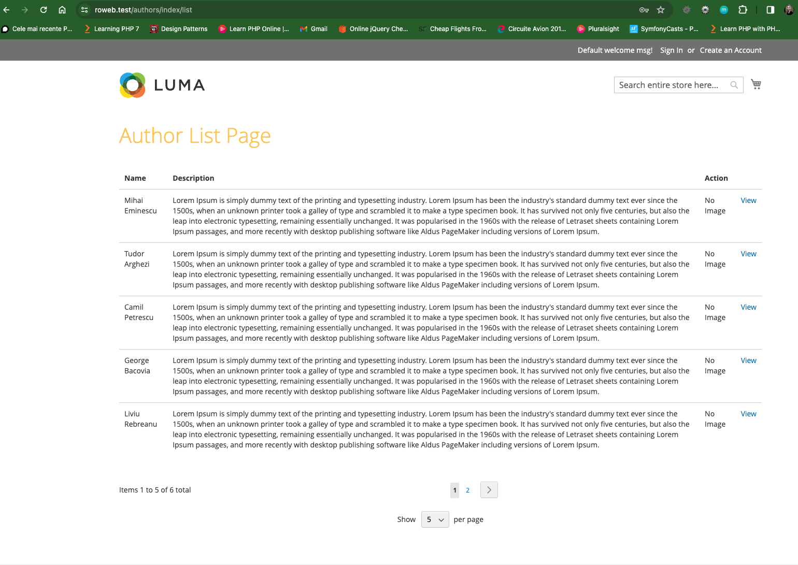
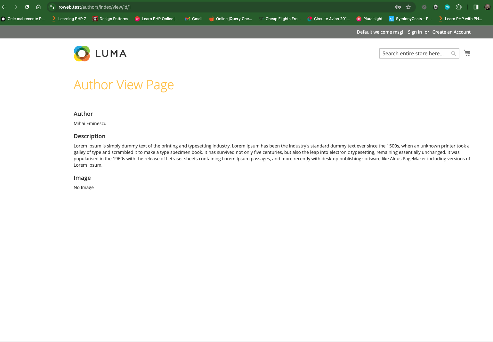
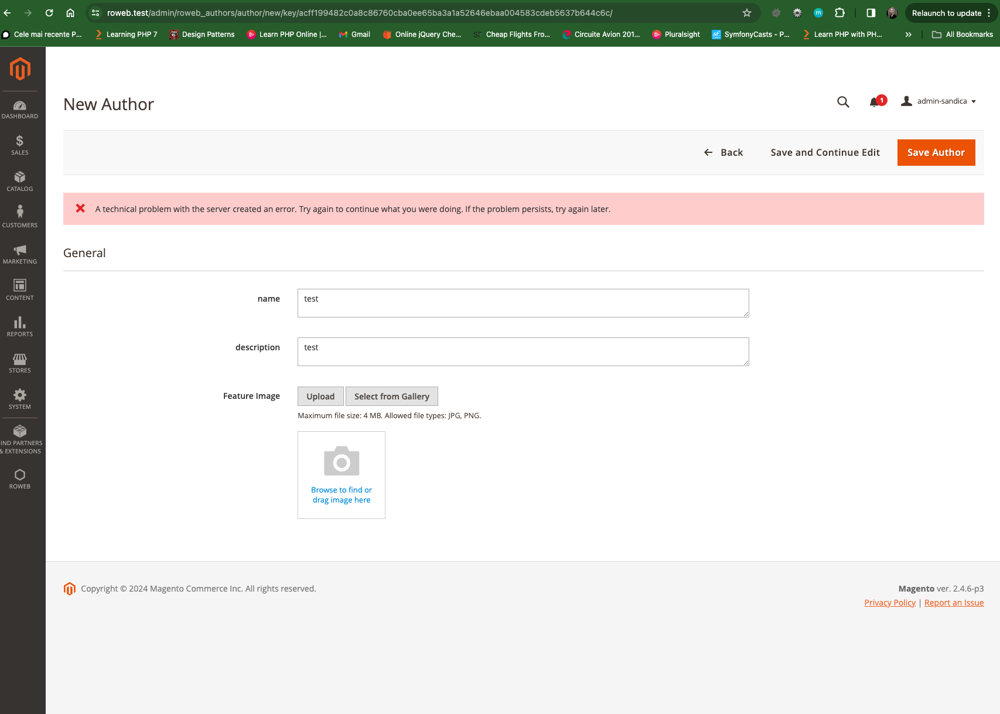

Authors Module
========================

## What is Authors Magento 2 Module?

This module allow possibility to create and manage authors and  to display them in front  

## Who is developing this module ? 

This module is generated by [here](https://mage2gen.com/) and modified according to the requirements

## Enviroment

This configuration is intended to be used as a Docker-based development environment for Magento 2.
[here](https://github.com/markshust/docker-magento?tab=readme-ov-file#setup)

## Main Features

### Author Admin-panel 

* **Author Labels:**

This module allows you to **create/edit/delete author** .

* **List Author Label:**

* **Add Author Label:**

* **Edit Author Label:**

* **Delete Author Label:**

### Author on front

* **Author labels are displayed in Author Listing and Author Details pages.**

This page contain a link to the Author Listing page and a form for creating New Author(not implemented)

This page list all authors and contain a button "View" that open new author page with detalis.

This page contain details of author

## NOT DONE Feature:

- image upload - error when i want to upload the image from local directory 
- i tried all the solutions found on internet but didn't work for me!!